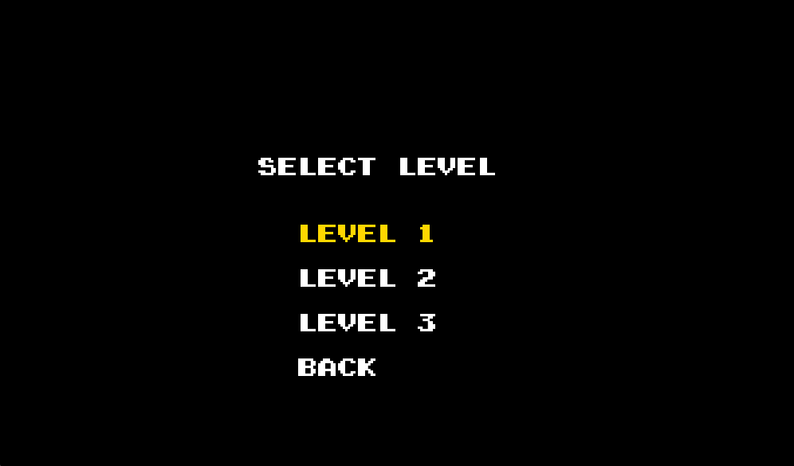
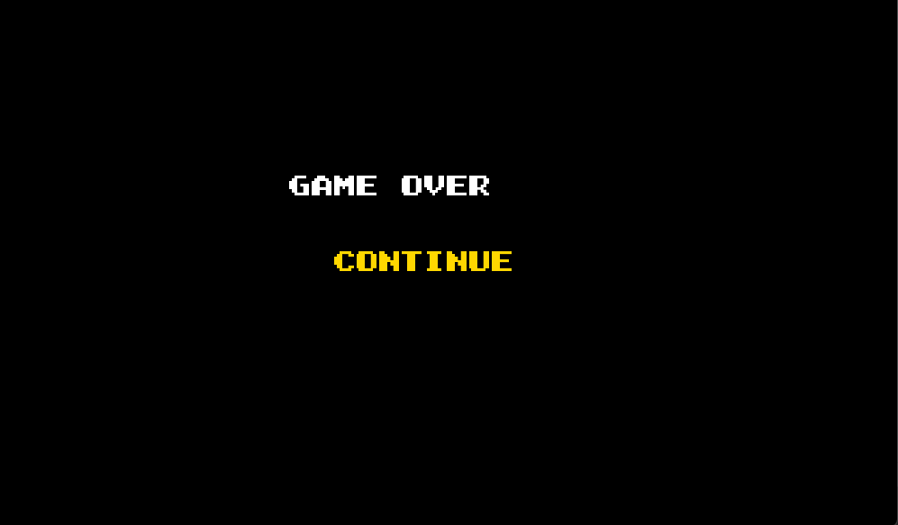
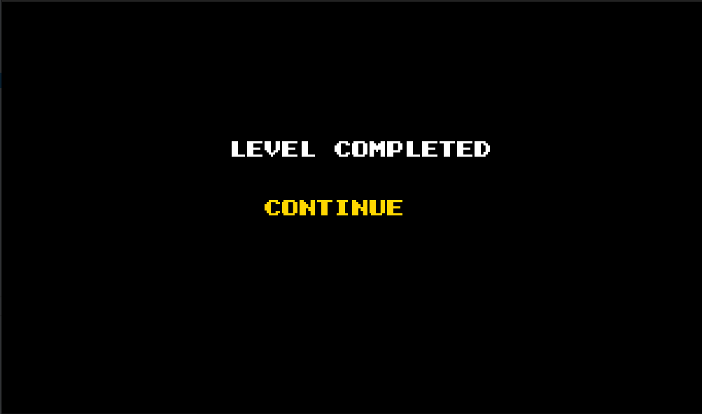
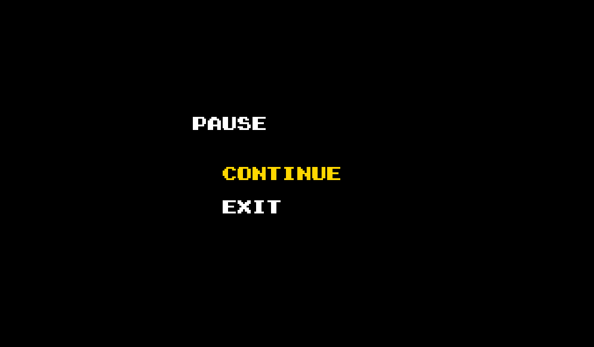
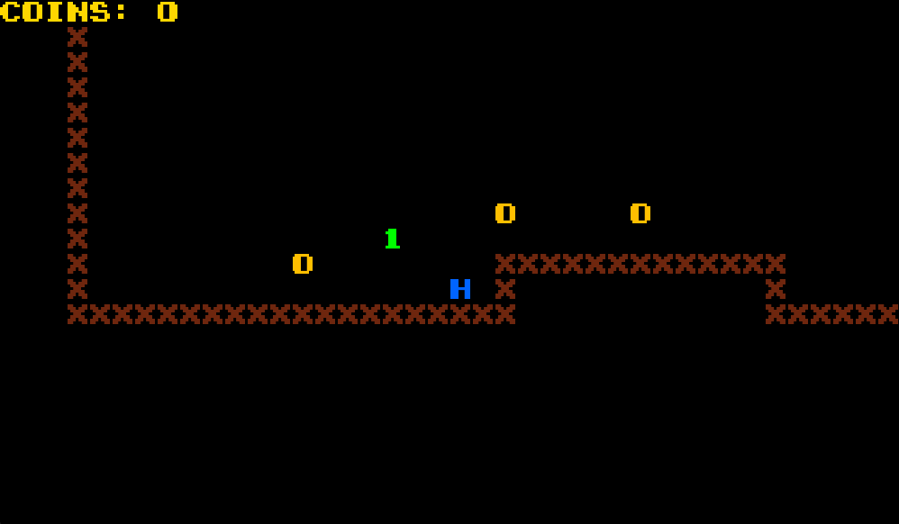
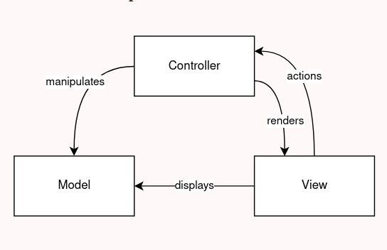
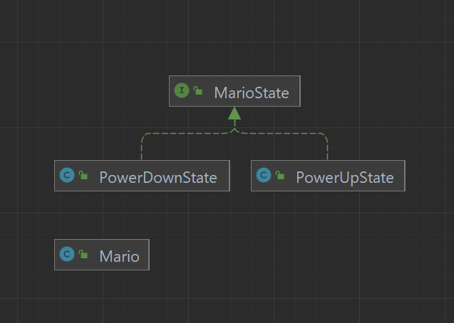
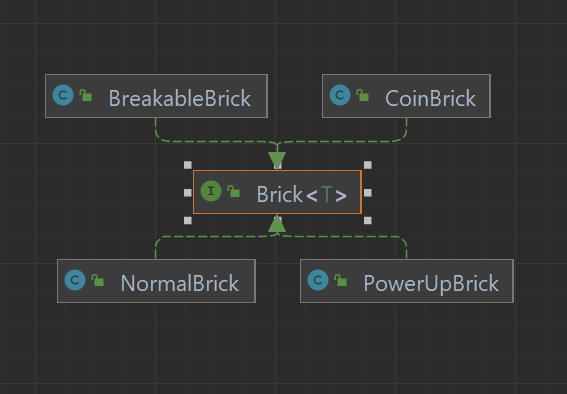
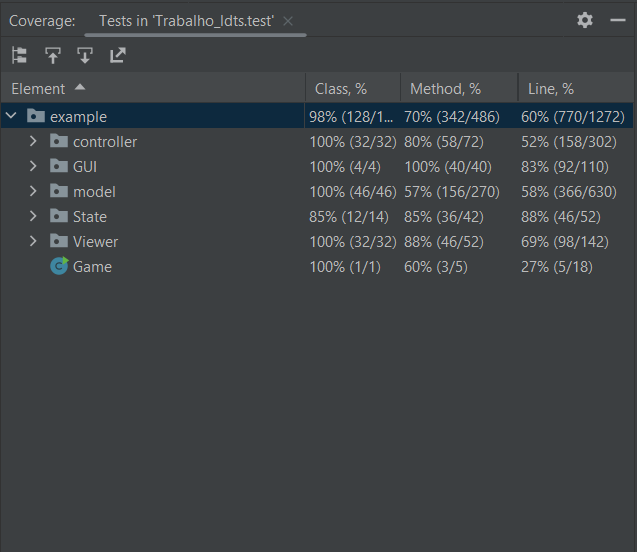

# project-l12gr02
project-l12gr02 created by GitHub Classroom

### -Super Mario Bros

A text based Super Mario bro styled game, where you can complete levels and collect coins while enemies try to kill you.
A level is successfully completed when Mario reaches the Flag without dying

## IMPLEMENTED FEATURES

**Jumping** - Mario will jump when the up arrow key is pressed.

**Gravity** - Down force being constantly applied on enemies and Mario.

**Coins** - Coins will be collected by Mario when he hits them.

**Enemy** - When an enemy collides with Mario the game returns to the Menu State. Enemies can be killed when stomped by mario.

**Camera** - Saves the screen position of each element but hero , so that when we draw them it gives the illusion of our hero moving through the map

**DeadFall** - Returns to the main mainMenu if Mario falls from the map.

**Power up** - Upon catching a Power up , mario gets to kill an enemy. When they collide the enemy dies and mario loses his power up state. If mario catches a power up when in a power up state the player gets 10 extra coins.

**Menus** - Menus allows the player to browse through and pause the game.

**Bricks** - Different types of bricks have different behaviors with them being : Surprise brick that gives a power up when activated ,Breakable Brick that breaks when activated ,Coin Brick that spawns a coin when activated and normal brick.

**End Flag** - A flag that lets successfully completes the level when collided with mario.

## ScreenShots

  

  <b><i>Fig 1. Main menu</i></b>

  

  <b><i>Fig 2. Select level menu</i></b>

  

  <b><i>Fig 3. Game Over menu</i></b>

  

  <b><i>Fig 4. EndGame menu</i></b>

  

  <b><i>Fig 5. Pause menu</i></b>

  

  <b><i>Fig 6. Gameplay</i></b>

## PLANNED FEATURES

all planned features where implemented
## Design

### 1. MVC

### Problem in context:
One of the main issues when starting our project was the foundation on which our game would run.

### The Pattern
To solve our main issue we decided to choose an architectural pattern that would make it possible to organize our code, so we went with a Model-View-Controller.
The main idea behind the MVC pattern is to divide our code into 3 steps allowing us to break the frontend and backend of the game into separate components.

### Implementation
For the implementation of this pattern we created three parts :
-Model which is responsible for saving the different type of our game components such as Mario, COin, Enemy...

-Viewer which is responsible for performing tasks such as the drawing.

-Controller which is responsible for the movement of different elements of our game.

  

  <b><i>Fig 7. Brick strategy</i></b>

### Consequences

-More organizer game that allows us to implement more easily new elements to our game.

### 2. State Pattern

### Problem in Context:
Being that mario is able to change his state at any given moment throughout the game instantaneously we needed to implement a design pattern that simplified this task.

### The Pattern
To solve this issue we decided on a State pattern

### Implementation

We start by creating a reference ,to one of the two states, stored in  mario(Mario) that represents the present state of mario.Then we create an interface(MarioState) and make the different classes that represents the states of mario (PowerDownState and PowerUpState)
follow the interface.Now to transition the context into another state, we update the State in mario with a new desired state.

### Consequences

-Makes it effortless to change mario abilities mid-game.

-Organizes the code related to particular states into different classes, -simplifying the code.

  

  <b><i>Fig 8. Mario state</i></b>

## 3. Strategy Pattern

### Problem in Context:
One of the most known mechanics of super mario is the different boxes that hold special abilities such as power ups , coins etc...
In our game the boxes are named "Bricks" and we needed to find a way to different behaviors from the same object

### The Pattern
To solve this issue we decided on a Strategy pattern

### Implementation
To implement this pattern in our game we started by creating an interface(Brick) that as a method that retrieves a specific action when the brick is hit
and from that interface we create our different type of bricks.

### Consequences

-You can replace inheritance with composition.

-easier to organize and define the behavior of a certain brick

  

  <b><i>Fig 9. Brick strategy</i></b>

## Code smells

**Duplicate Code** - all type of menus share similar code making them almost identical

**Long methods** - There are some methods such as moveHero in mario controller that are way too long and should've been broken down.

**Lazy class** - We use camera controller to set the new screen positions for coins, enemies and power ups. But other than that the camera and camera viewer are 

### UML

  

  <b><i>Fig 10. UML</i></b>

## Tests

  

  <b><i>Fig 11. Test Coverage</i></b>

**pitests** - we weren't able to run pitests because of compatibility issues.

## Self-evaluation

-José Ferreira:33,(3)%

-Luís Relvas:33,(3)%

-João Afonso Santos:33,(3)%

